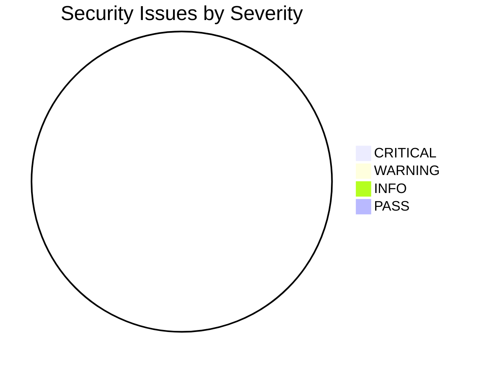

# Security Scan Report — {{CHANGE_NAME}}

> Generated by `/feature-pipeline <name> --only security` or `/security-scan`

---

## Summary

| Metric | Value |
|--------|-------|
| **Scan Date** | {{DATE}} |
| **Backend** | .NET 8 / C# |
| **Frontend** | Angular 17 / TypeScript |
| **Total Files Scanned** | {{COUNT}} |
| **Total Issues** | {{COUNT}} |

### Severity Breakdown

| Severity | Count | % |
|----------|-------|---|
| 🔴 CRITICAL | 0 | 0% |
| 🟠 WARNING | 0 | 0% |
| 🟡 INFO | 0 | 0% |
| 🟢 PASS | 0 | 0% |



---

## Checklist Results

### Authentication & Authorization

| # | Rule | Status | Detail |
|---|------|--------|--------|
| 1 | `[Authorize]` trên mọi controller action | 🟢 PASS | |
| 2 | `FunctionConst` role-based access | 🟢 PASS | |
| 3 | JWT token validation | 🟢 PASS | |

### Input Validation

| # | Rule | Status | Detail |
|---|------|--------|--------|
| 4 | Data Annotations trên Request DTOs | 🟢 PASS | |
| 5 | SQL Injection prevention (parameterized queries) | 🟢 PASS | |
| 6 | XSS prevention (output encoding) | 🟢 PASS | |
| 7 | PatternConstants — no hardcoded regex | 🟢 PASS | |

### Data Protection

| # | Rule | Status | Detail |
|---|------|--------|--------|
| 8 | Sensitive data NOT in logs (PIN, password, token) | 🟢 PASS | |
| 9 | Sensitive data NOT in response DTOs | 🟢 PASS | |
| 10 | `[JsonIgnore]` on internal Entity fields | 🟢 PASS | |

### Error Handling

| # | Rule | Status | Detail |
|---|------|--------|--------|
| 11 | Stack trace NOT exposed to client | 🟢 PASS | |
| 12 | Generic error message for unhandled exceptions | 🟢 PASS | |
| 13 | `_logger.LogError(ex, ...)` in catch blocks | 🟢 PASS | |

### API Security

| # | Rule | Status | Detail |
|---|------|--------|--------|
| 14 | No hardcoded secrets/keys in source | 🟢 PASS | |
| 15 | Redis keys have TTL | 🟢 PASS | |
| 16 | Rate limiting configured | 🟢 PASS | |

### Frontend (Angular)

| # | Rule | Status | Detail |
|---|------|--------|--------|
| 17 | HttpInterceptor for auth token | 🟢 PASS | |
| 18 | No `innerHTML` binding (XSS) | 🟢 PASS | |
| 19 | Route guards on protected pages | 🟢 PASS | |

### Custom Exclusions (Auto-PASS)

| # | Rule | Reason |
|---|------|--------|
| — | Permissive CORS Configuration | Internal deployment |
| — | HTTPS enforcement | Internal deployment |

---

## Detailed Issues

### 🔴 CRITICAL Issues

_None found._

### 🟠 WARNING Issues

_None found._

---

## Files Scanned

### Backend (.NET)
```
{{LIST_OF_CS_FILES}}
```

### Frontend (Angular)
```
{{LIST_OF_TS_FILES}}
```
